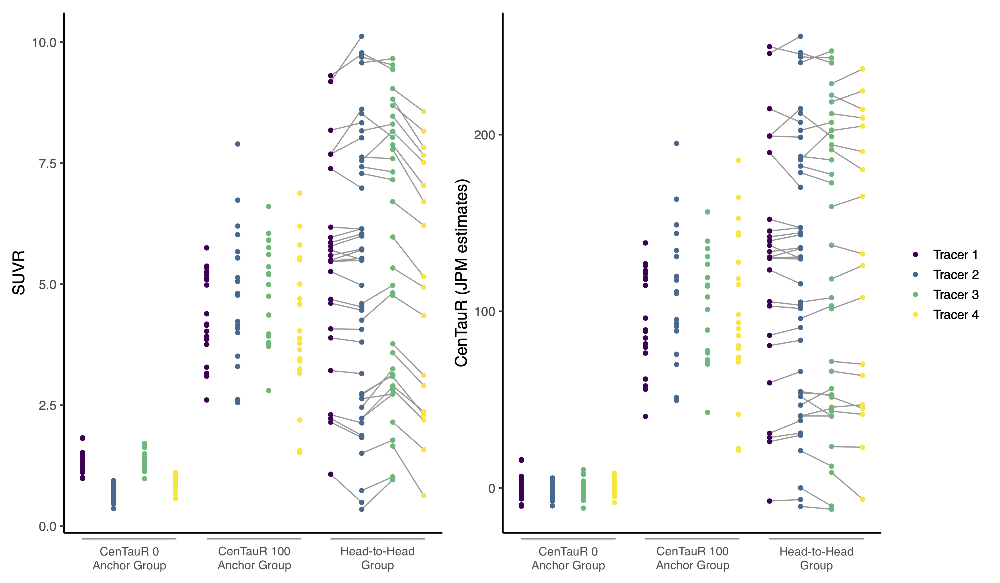
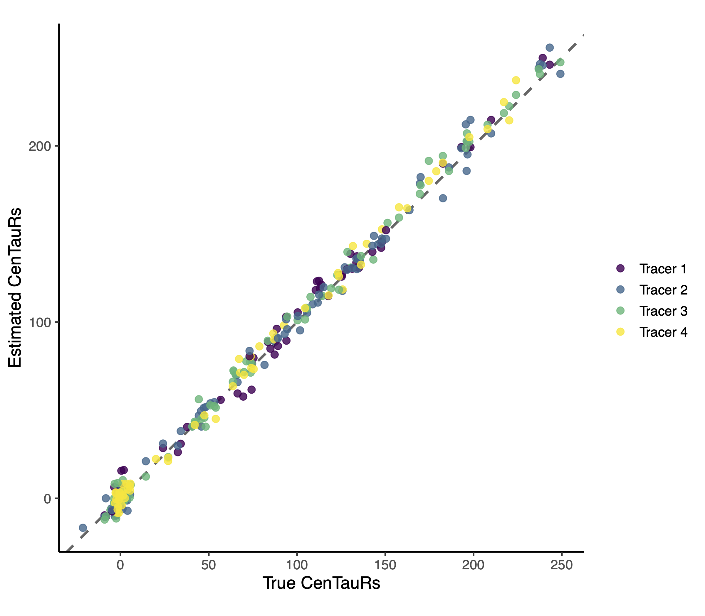

# Joint Propagation Model
The Joint propagation model (JPM) is a model developed for deriving a harmonized quantification of tau PET data across different tracers. The JPM estimates equations for mapping regional SUVRs across multiple PET tracers to a harmonized scale named *CenTauRs*. The JPM simultaneously estimates all mapping equations using data from head-to-head studies of multiple tracers and data from anchor point subjects that fulfill predefined criteria (see paper for criteria for anchor point subjects).  

The JPM is implemented in the R and C++ using the [Template Model Builder](https://kaskr.github.io/adcomp/_book/Introduction.html) framework.

> [!NOTE]
> If you are using this code, please reference
> 
> [Leuzy, A., Raket, L.L., et al. "Harmonizing tau positron emission tomography in Alzheimer's disease: The CenTauR scale and the joint propagation model". *Alzheimer's & Dementia* (2024)](https://dx.doi.org/10.1002/alz.13908)

Example
--------------------
Below are ilustrations of how JPM can produce harmonized CenTauR units from SUVR obtained from different tracers. Simulations can be run using [example.R](example.R) which also illustrates how to use the JPM code.

Observed SUVRs across four different tracers and results on the harmonized CenTauR scale.

Relationship between the estimated CenTauRs and the true CenTauRs used to generate the data.

